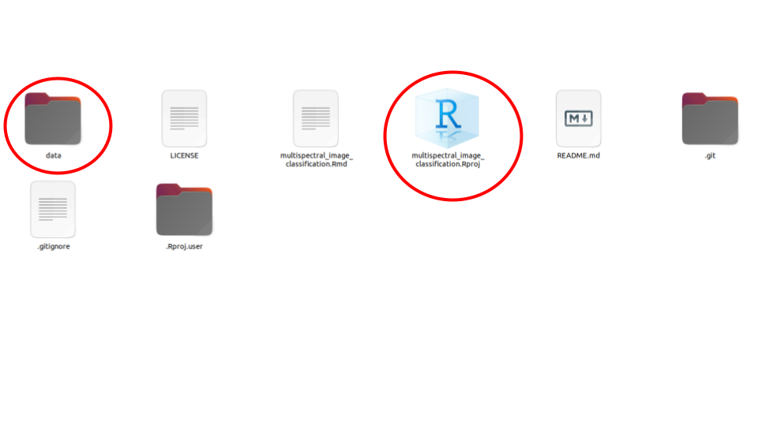

<!-- README.md is generated from README.Rmd. Please edit that file -->

```{r, include = FALSE}
knitr::opts_chunk$set(
  collapse = TRUE,
  comment = "#>"
)
```

# Multispectral image classification

This is the repository with all the materials for the lab: Multispectral 
image classification in R with Supervised and Unsupervised methods.

You can find the render version of this materials in this [site](https://ceos-university-of-alberta.github.io/ceos_tutorials/multispectral_image_classification/)


## Objetive:

 - To understand how to classify multispectral images, using both a
 supervised  and unsupervised approach with R.
 
## How to use this repository?

In order to use the materials in this repository, you need first to download
it. You can do this clicking in the green button **code**. A menu will open.
Click in thhe option **Download ZIP**


After this, go to your computer and unzip the files. Inside the 
`multispectral_image_classification` folder, you will find several files:



Create a **data** folder and put in there all the data files that are shared
with you. 


Then, click to open the *.Rproj* file. This will open RStudio with a defined
working environment and a R session.

In the files panel, you will see all the files that you need to work on this
lab. Open the file called `multispectral_image_classification.Rmd` (Pay
attention to the **Rmd** file extension)

Now you are all set!

## Help us to improve!

If you see any error in this materials or want to collaborate to improve
this documentation, please open an issue on our [repo](https://github.com/CEOS-University-of-Alberta/multispectral_image_classification/issues) with your ideas or corrections.

<center>


</center>

